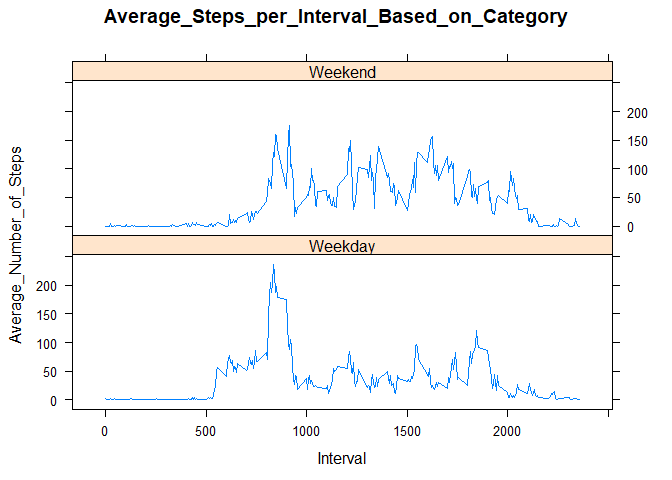

## Loading and preprocessing the data

```r
mydata <- read.csv("activity.csv")
mydata$day <- weekdays(as.Date(mydata$date))
mydata$DateTime<- as.POSIXct(mydata$date, format="%Y-%m-%d")
```

## What is mean total number of steps taken per day?

```r
numsteps <- aggregate(mydata$steps ~ mydata$date, FUN=sum, )
colnames(numsteps)<- c("Date", "Steps")

hist(numsteps$Steps,breaks=5,xlab="Steps",main="Number_of_Steps_per_Day")
```

<!-- -->

```r
as.integer(mean(numsteps$Steps))
```

```
## [1] 10766
```

```r
as.integer(median(numsteps$Steps))
```

```
## [1] 10765
```

## What is the average daily activity pattern?

```r
nonadata <- mydata[!is.na(mydata$steps),]
stepsint <- ddply(nonadata, .(interval), summarize, Avg = mean(steps))

p <- ggplot(stepsint, aes(x=interval, y=Avg), xlab = "Interval", ylab="Average_Number_of Steps")
p + geom_line()+xlab("Interval")+ylab("Average_Number_of_Steps")+ggtitle("Average_Number_of Steps_per_Interval")
```

<!-- -->

```r
stepsmax <- max(stepsint$Avg)
stepsint[stepsint$Avg==stepsmax,1]
```

```
## [1] 835
```

## Imputing missing values

```r
nrow(mydata[is.na(mydata$steps),])
```

```
## [1] 2304
```

```r
avgnona <- ddply(nonadata, .(interval, day), summarize, Avg = mean(steps))
nadata <- mydata[is.na(mydata$steps),]
newdata <- merge(nadata, avgnona, by=c("interval", "day"))

newdata2 <- newdata[,c(6,4,1,2,5)]
colnames(newdata2)<- c("steps", "date", "interval", "day", "DateTime")
mrgdata <- rbind(nonadata, newdata2)

numsteps2 <- aggregate(mrgdata$steps ~ mrgdata$date, FUN=sum, )
colnames(numsteps2)<- c("Date", "Steps")
as.integer(mean(numsteps2$Steps))
```

```
## [1] 10821
```

```r
as.integer(median(numsteps2$Steps))
```

```
## [1] 11015
```

```r
hist(numsteps2$Steps, breaks=5, xlab="Steps", main = "Steps_per_Day_with_No_NAs", col="Red")
hist(numsteps$Steps, breaks=5, xlab="Steps", main = "Steps_per_Day_with_No_NAs", col="Blue", add=T)
legend("topright", c("Imputed Values", "No NA Data"), fill=c("red", "blue") )
```

<!-- -->

## Are there differences in activity patterns between weekdays and weekends?

```r
mrgdata$Category <- ifelse(mrgdata$day %in% c("Saturday", "Sunday"), "Weekend", "Weekday")

stepsint2 <- ddply(mrgdata, .(interval, Category), summarize, Avg = mean(steps))
xyplot(Avg~interval|Category, data=stepsint2, type="l",  layout = c(1,2), main="Average_Steps_per_Interval_Based_on_Category",ylab="Average_Number_of_Steps", xlab="Interval")
```

<!-- -->

